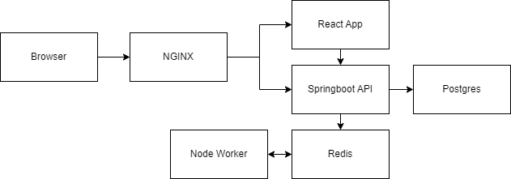

# Fib Calculator

An overly complex system built to calculate the value of a Fibonacci number at a given index (provided that index isn't too high as we don't have all day for the poor Node worker to calculate the value at index 1000000).

## The Goal

As mentioned, this system is far too complex for what it actually achieves. However, the goal was not to build an optimized Fib calculator that worked faster than the speed of sound. Rather, the aim is understand how to orchestrate different services to work with each other, with Docker as the composer. Later, the aim is to implement a continuous integration flow with multiple container deployments to AWS and to incorporate Kubernetes after that.

For now, I am simply looking to develop a Fib calculator in a local environment using a multi service approach.

## The Architecture

This repo has the following sub directories:

- fib-api
- fib-worker
- fib-client
- nginx

(Almost) Each directory contains a service that is composed by Docker. The DB directory contains a txt file with the postgres DB password. This was a small attempt to replicate some sort of security measures. Of course, in a prod environment, this wouldn't be an optimal way to go.

### Nginx

The Nginx server is simply responsible for routing the different browser requests to either the Client or the Server. In this system, if the request begins with `api/`, the Nginx server knows to route that request to the server. If the request is not prefixed with `api/`, Nginx routes the request to the client.

### Fib API

The API is a SpringBoot Application. The API serves two different critical pieces of information to the client.

1. The indices that the client has previously requested. Stored persistently in a Postgres DB.
2. The Fibonacci values of the corresponding indices.

To calculate a Fibonacci value of a given index, the system makes use of Redis' PubSub API. Spring publishes an index that a user has inputted on a particular channel. Next, a Node worker (to be discussed later) subscribed to that channel will receive the index and calculate the value. The Node worker then publishes the calculated value which gets communicated back to Spring and served to the client.

### Fib Worker

The worker service is a simple Node application that leverages the Redis pubsub API. As mentioned earlier, the worker connects to the same Redis DB as the Spring app. Whenever the Spring app publishes a Fibonacci index to be calculated, the worker receives that index and publishes the appropriate Fib value along with the index.

A small note, this Fib algorithm is far from optimal. If I wanted to improve performance of the calculator, I'd simple implement a memoized algorithm. However, the actual Fib calculator was not the focus of this project.

### Fib Client

At the time of writing, the client is a simple React application making use of Axios to communicate with the Spring API. Important to note, the front end of this system was not the focus for this project and therefore was sources from various places. This explains why it is such jumbled, old React code.
